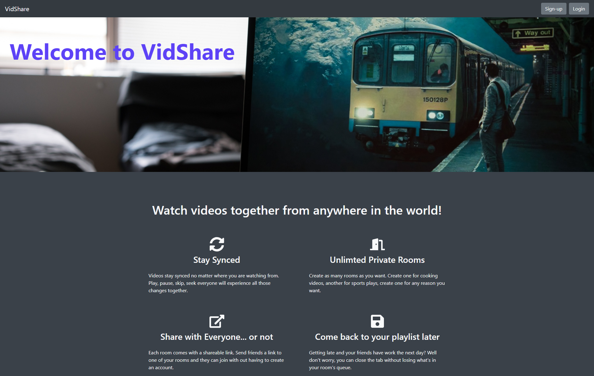
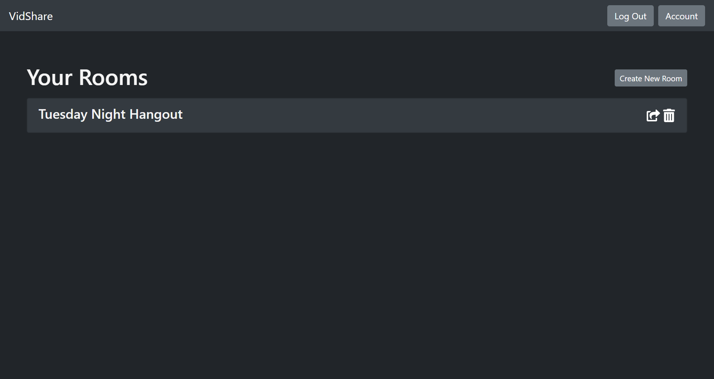
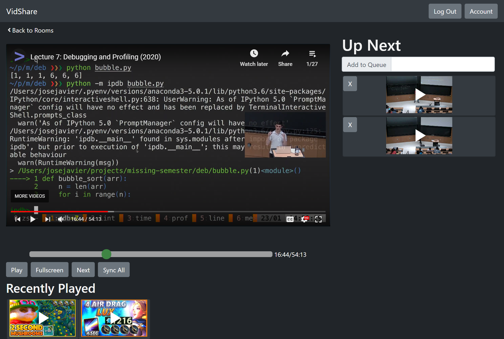

# VidShare

Welcome to VidShare! This site was designed to allow users to watch videos with their friends or loved ones any where in the world. The video player allows for a synchronous video watching experience where if one video pauses all videos pause and if one person moves on to the next video in queue then all players move to the next video. 

A user can create multiple viewing rooms for different viewing parties or if they just want to seperate their video viewing experience. These rooms can be shared with users that don't have accounts so anyone can join. 

 Users are able to add videos to a player queue and can reorganize it however they feel and those changes will show across all devices and persist across sessions. The room will also locally store previously watched videos so users can return to them at a later time. 

 

 ## Technologies Used

 - React
 - Redux
 - Socket.io
 - Heroku
 - PostgreSQL
 - Passport
 - Bcrypt
 - JSON Web Token
 - Nodemailer
 - Node.js
  